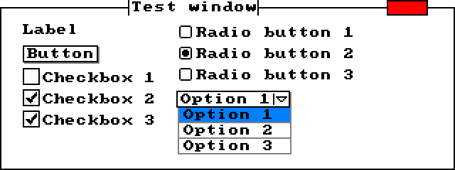

# UI
##### **This project is still incomplete. This notice will be removed when the project is functional**


This simple callback driven UI library implements many UI elements, like labels, buttons, and dropdowns to name a few. UI element colors are customizable, and the user configurations are stored nontemporally in AppData. Windows and UI elements are constructed at run time from JSON files.

Here's the source for the above window:

```json
{
    "name"     : "Test window",
    "width"    : 320,
    "height"   : 120,
    "elements" : [
        {
            "type"     : "LABEL",
            "name"     : "label",
            "text"     : "Label",
            "x"        : 16,
            "y"        : 16
        },
        {
            "type"     : "BUTTON",
            "name"     : "button",
            "text"     : "Button",
            "x"        : 16,
            "y"        : 32
        },
        {
            "type"      : "CHECKBOX",
            "name"      : "checkbox",
            "x"         : 16,
            "y"         : 48,
            "labels"    : [
                "Checkbox 1",
                "Checkbox 2",
                "Checkbox 3"
            ],
            "checked"   : [
                false,
                true,
                true
            ]
        },
        {
            "type"      : "DROPDOWN",
            "name"     : "dropdown",
            "x"         : 124,
            "y"         : 64,
            "options"   : [
                "Option 1",
                "Option 2",
                "Option 3"
            ],
            "index"     : -1,
            "collapsed" : true
        },
        {
            "type"      : "RADIOBUTTON",
            "name"      : "radiobutton",
            "x"         : 124,
            "y"         : 16,
            "labels"    : [
                "Radio button 1",
                "Radio button 2",
                "Radio button 3"
            ],
            "checked index" : 1
        }
    ]
}
```

[ [UI Window JSON](UI/UI Window.json) ]
