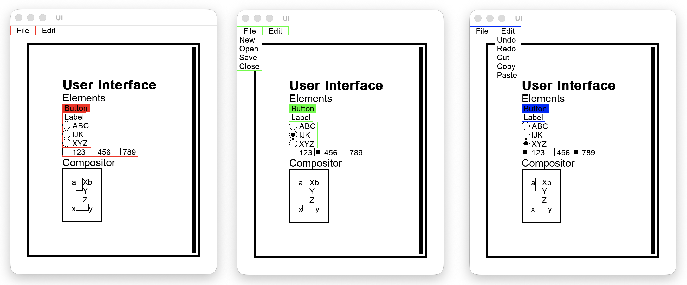

<h1 align="center">ui</h1>

<p align="center">A user interface framework built on gsdk</p>

<p align="center">
    
    
    
    <br>
</p>

> **Jump to:**  
> [Build](#build) • [License](#license)



## Build
To build ui, run

```bash
$ make -C gsdk
$ make
```
## License
This project is licensed under the MIT License - see [LICENSE](./LICENSE) for details.

### Made with ❤️ for 👥 across 🌎🌍🌏
 